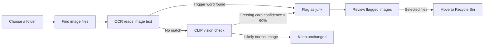

#  Media Cleaner


A local Streamlit application for finding and safely cleaning greeting cards, quote images, and other unwanted WhatsApp media. It combines OCR text detection with a vision AI fallback, then lets you review the results before moving selected files to the Windows Recycle Bin.

## Visual Workflow



## Benefits

- **Saves time:** scan an entire folder instead of checking images one by one.
- **Two detection methods:** OCR catches configured phrases, while CLIP helps find greeting cards with little or no readable text.
- **Review before cleanup:** flagged images are displayed in the app and selected by checkbox.
- **Safer deletion:** files are moved to the Windows Recycle Bin instead of being permanently deleted.
- **Duplicate-resistant scanning:** image paths are collected in a set so the same file is not scanned twice.
- **Local processing:** images are processed by the application on your computer after the required models are downloaded.
- **Configurable rules:** trigger words, OCR languages, and the default scan directory are stored in `config.json`.

## How It Works

1. The app loads settings from `config.json`.
2. It searches the selected folder and subfolders for `.jpg`, `.jpeg`, `.png`, and `.webp` files.
3. Each image is preprocessed and sent to EasyOCR.
4. If configured trigger words are detected, the image is flagged.
5. If OCR does not find a match, CLIP classifies the image. Greeting cards are flagged when confidence is above 60 percent.
6. The app displays flagged images with the reason for each result.
7. You choose which files to remove. Selected files are moved to the Recycle Bin.

## Requirements

- Windows
- Python 3.10 or newer
- A working internet connection for the first model downloads
- NVIDIA GPU with compatible CUDA support for the configured GPU packages, or code changes to run the models on CPU
- Enough disk space for EasyOCR and the CLIP model (the CLIP model is approximately 600 MB)

## Installation

Open PowerShell in the project directory:

```powershell
python -m venv venv
.\venv\Scripts\Activate.ps1
python -m pip install --upgrade pip
pip install -r requirements.txt
```

If PowerShell blocks activation, run this once for the current user:

```powershell
Set-ExecutionPolicy -Scope CurrentUser RemoteSigned
```

## Run the App

```powershell
.\venv\Scripts\Activate.ps1
streamlit run app.py
```

Streamlit will open the application in your browser. Enter the folder to scan in the sidebar, then select **Start Scan**.

## Configuration

Edit `config.json` to customize the scan:

```json
{
  "trigger_words": [
    "good morning",
    "shubh prabhat",
    "blessings",
    "diwali",
    "happy new year",
    "good night"
  ],
  "languages": ["en", "hi"],
  "scan_directory": "./sample_data"
}
```

- `trigger_words`: phrases that cause OCR-based flagging.
- `languages`: EasyOCR language codes. The default supports English and Hindi.
- `scan_directory`: folder shown as the default in the Streamlit sidebar.

The scan folder can also be changed directly in the app without editing the configuration file.

## Project Structure

```text
Cleaner/
├── app.py                 # Streamlit user interface and scan workflow
├── config.json            # Trigger words, OCR languages, and default folder
├── requirements.txt       # Python dependencies
├── test_run.py            # Command-line model and scanning smoke test
├── core/
│   ├── file_manager.py    # Configuration, file discovery, and safe deletion
│   └── scanner.py         # OCR and CLIP image analysis
└── sample_data/           # Local images used for testing
```

## Safety Notes

- Review every flagged image before using the cleanup action.
- The classifier can produce false positives or false negatives; its result is only a recommendation.
- Keep backups of important media.
- The application currently uses `gpu=True` when loading the AI models. CPU-only machines may require changing that argument in `app.py` and installing CPU-compatible PyTorch packages.
- The first run can take longer because EasyOCR and CLIP download their model files.

## Command-Line Smoke Test

To scan the configured folder without opening the Streamlit interface:

```powershell
python test_run.py
```

This initializes the models and prints the detected files, classification result, and reason for each image.

## License

No license has been specified for this project yet.
